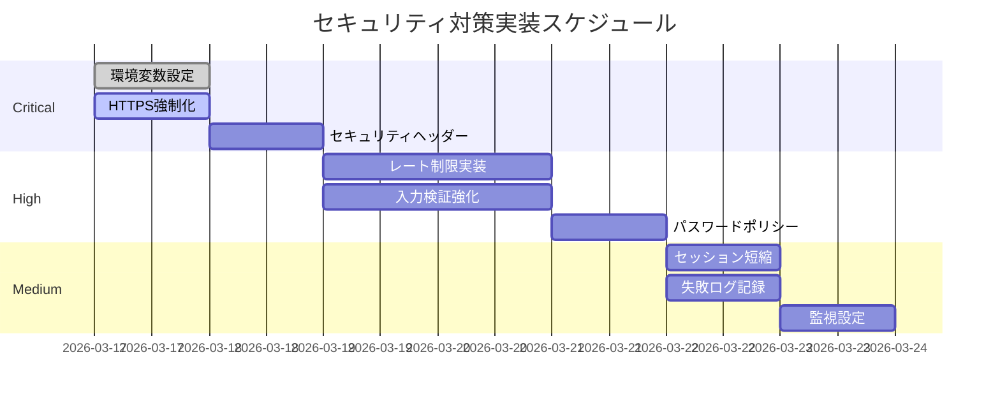

# セキュリティ対策（管理ダッシュボード側）

**作成日:** 2026-03-17
**対象:** Next.js管理ダッシュボード
**バージョン:** 1.0

---

## 📋 目次

1. [概要](#概要)
2. [認証セキュリティ](#認証セキュリティ)
3. [セッション管理](#セッション管理)
4. [APIエンドポイントセキュリティ](#apiエンドポイントセキュリティ)
5. [Supabaseアクセス制御](#supabaseアクセス制御)
6. [フロントエンドセキュリティ](#フロントエンドセキュリティ)
7. [環境変数管理](#環境変数管理)
8. [現在の問題点と改善策](#現在の問題点と改善策)

---

## 概要

### システム構成

```
┌─────────────────────────────────────┐
│     ブラウザ（スタッフ）             │
│  - ログインフォーム                  │
│  - 管理画面UI                       │
└────────────┬────────────────────────┘
             │ HTTPS
             ▼
┌─────────────────────────────────────┐
│   Next.js App Router（SSR/API）     │
│  - /app/admin/* (Page)              │
│  - /app/api/* (API Route)           │
│  - middleware.ts (認証チェック)     │
└────────────┬────────────────────────┘
             │ SERVICE_ROLE_KEY
             ▼
┌─────────────────────────────────────┐
│      Supabase PostgreSQL            │
│  - staff テーブル（認証）           │
│  - profiles, stamp_history 等       │
└─────────────────────────────────────┘
```

### 使用技術スタック

- **フレームワーク**: Next.js 15 (App Router)
- **言語**: TypeScript
- **データベース**: Supabase (PostgreSQL)
- **認証**: 独自実装（bcrypt + HMAC署名Cookie）
- **デプロイ**: Vercel（予定）

---

## 認証セキュリティ

### 現在の実装

#### 1. 認証方式

**2段階フォールバック方式:**

```typescript
// 優先順位1: スタッフテーブル認証
const { data: staff } = await supabase
  .from("staff")
  .select("id, password_hash")
  .eq("login_id", username)
  .eq("is_active", true)
  .maybeSingle();

if (staff && bcrypt.compareSync(password, staff.password_hash)) {
  // ログイン成功
}

// 優先順位2: 環境変数フォールバック
if (username === ADMIN_USER && password === ADMIN_PASSWORD) {
  // ログイン成功（従来方式）
}
```

#### 2. パスワードハッシュ化

**使用アルゴリズム:** bcrypt (saltRounds = 10)

```typescript
import bcrypt from "bcryptjs";

// スタッフ登録時
const hashedPassword = await bcrypt.hash(plainPassword, 10);

// ログイン時
const isValid = await bcrypt.compare(plainPassword, hashedPassword);
```

**bcryptの特徴:**
- ✅ ソルト自動生成
- ✅ レインボーテーブル攻撃に強い
- ✅ 計算コストが高く総当たり攻撃に強い
- ✅ 将来的にコストファクタを上げられる

#### 3. セッショントークン生成

**HMAC-SHA256署名付きトークン:**

```typescript
// トークン形式: {prefix}.{expiry}.{signature}
// 例: "staff-uuid-123.1710691200000.a3f2e1..."

function createSessionToken(staffId?: string): string {
  const expiry = Date.now() + 7 * 24 * 60 * 60 * 1000; // 7日後
  const prefix = staffId ?? "admin";
  const payload = `${prefix}.${expiry}`;
  const sig = crypto
    .createHmac("sha256", AUTH_SECRET)
    .update(payload)
    .digest("hex");
  return `${payload}.${sig}`;
}
```

**セキュリティ特性:**
- ✅ 署名により改ざん検知
- ✅ 有効期限付き
- ✅ サーバー側でのデータベース参照不要
- ❌ トークン自体に機密情報を含まない（staff_idのみ）

### セキュリティ上の問題点

#### 🔴 Critical

1. **レート制限がない**
   ```
   問題: 総当たり攻撃（Brute Force）に対して無防備
   影響: パスワードが推測される可能性
   対策: 後述の「改善策」参照
   ```

2. **環境変数に平文パスワード**
   ```bash
   # .env.local
   ADMIN_PASSWORD=admin  # ⚠️ 平文で保存
   ```
   ```
   問題: .env.localが漏洩するとパスワードが露出
   影響: 管理画面への不正アクセス
   対策: 本番環境では強力なランダム文字列に変更
   ```

#### 🟠 High

3. **多要素認証（MFA）がない**
   ```
   問題: パスワードのみの1要素認証
   影響: パスワード漏洩時に即座にアクセス可能
   対策: Google Authenticator / SMS OTP の導入検討
   ```

4. **パスワードポリシーが弱い**
   ```typescript
   // 現在: 最低文字数制限なし
   // 推奨: 最低8文字、大文字・小文字・数字・記号を含む
   ```

#### 🟡 Medium

5. **アカウントロックアウト機能なし**
   ```
   問題: 連続ログイン失敗時にアカウントをロックしない
   影響: 総当たり攻撃の継続を許す
   対策: 5回失敗で15分間ロック
   ```

6. **ログイン履歴の記録が不完全**
   ```typescript
   // 現在: activity_logs に成功時のみ記録
   // 推奨: 失敗時も記録（IPアドレス、User-Agent含む）
   ```

---

## セッション管理

### Cookie設定

#### 現在の実装

**デバイス別Cookie:**

```typescript
// Cookie名: admin_session_{deviceId}
// 例: admin_session_desktop-chrome-001

res.cookies.set('admin_session_desktop123', token, {
  httpOnly: true,         // ✅ XSS対策
  secure: NODE_ENV === 'production',  // ✅ HTTPS限定（本番のみ）
  sameSite: 'lax',        // ✅ CSRF対策
  path: '/',
  maxAge: 7 * 24 * 60 * 60  // 7日間
});
```

**セキュリティ特性:**

| 属性 | 値 | 効果 |
|-----|---|------|
| `httpOnly` | true | ✅ JavaScriptからアクセス不可（XSS対策） |
| `secure` | true (本番) | ✅ HTTPS通信時のみ送信 |
| `sameSite` | lax | ✅ クロスサイトリクエストを制限（CSRF対策） |
| `maxAge` | 7日間 | ⚠️ 長すぎる可能性 |

### セッション検証

#### Middleware（Edge Runtime）

**ファイル:** `middleware.ts`

```typescript
import { verifyAnySessionCookie } from "@/lib/simple-auth-verify";

export async function middleware(request: NextRequest) {
  if (request.nextUrl.pathname.startsWith("/admin")) {
    const cookies = new Map(
      request.cookies.getAll().map(c => [c.name, c.value])
    );

    // すべての admin_session_* Cookie を検証
    if (!await verifyAnySessionCookie(cookies)) {
      return NextResponse.redirect(new URL("/admin/login", request.url));
    }
  }
}
```

**特徴:**
- ✅ すべてのページアクセス時に検証
- ✅ 有効期限切れを自動検知
- ✅ 署名検証で改ざんを防止
- ⚠️ セッションの強制無効化機能なし

#### API Route（Node.js Runtime）

**ファイル:** `lib/activity-log.ts`

```typescript
export function getStaffIdFromRequest(request: NextRequest): string | null {
  const allCookies = request.cookies.getAll();
  const sessionCookie = allCookies.find(c =>
    c.name.startsWith('admin_session')
  );

  if (!sessionCookie) return null;

  const session = verifySessionCookieServer(sessionCookie.value);
  return session?.staffId ?? null;
}
```

### セキュリティ上の問題点

#### 🟠 High

1. **セッション有効期限が長すぎる**
   ```
   現在: 7日間
   推奨: 1日間（または業務時間内のみ）
   リスク: 盗まれたセッションが長期間有効
   ```

2. **セッションのサーバー側管理なし**
   ```
   問題: Cookieのみで管理、サーバー側でセッションを破棄できない
   影響: ログアウト時もCookieを削除するだけ
   対策: Redisやデータベースでセッション管理
   ```

#### 🟡 Medium

3. **CSRF トークンなし**
   ```
   現在: SameSite=lax で部分的に対策
   推奨: CSRFトークンを使用した完全な対策
   ```

4. **セッション固定攻撃への対策なし**
   ```
   問題: ログイン後にセッションIDを再生成しない
   対策: ログイン成功時に新しいトークンを発行
   ```

---

## APIエンドポイントセキュリティ

### 認証チェック実装

#### パターン1: 操作ログ付き

```typescript
import { logActivityIfStaff, getStaffIdFromRequest } from "@/lib/activity-log";

export async function POST(request: NextRequest) {
  // 1. 認証チェック
  const staffId = getStaffIdFromRequest(request);
  if (!staffId && !isLegacyAdmin(request)) {
    return NextResponse.json({ error: "Unauthorized" }, { status: 401 });
  }

  // 2. ビジネスロジック
  const result = await doSomething();

  // 3. 操作ログ記録
  await logActivityIfStaff(request, "profile_update", {
    targetType: "profile",
    targetId: userId,
    details: { field: "stamp_count", value: newCount }
  });

  return NextResponse.json(result);
}
```

#### パターン2: SERVICE_ROLE_KEY 使用

```typescript
import { createSupabaseAdminClient } from "@/lib/supabase/server-admin";

export async function DELETE(request: NextRequest) {
  // SERVICE_ROLE_KEY クライアント（RLSをバイパス）
  const supabaseAdmin = createSupabaseAdminClient();

  // 削除操作（通常のANON_KEYでは実行不可）
  const { error } = await supabaseAdmin
    .from("stamp_history")
    .delete()
    .eq("user_id", userId)
    .gt("stamp_number", newCount);

  if (error) {
    return NextResponse.json({ error: error.message }, { status: 500 });
  }

  return NextResponse.json({ success: true });
}
```

### エンドポイント一覧とセキュリティレベル

| エンドポイント | 認証 | 権限 | 操作ログ | RLS |
|-------------|-----|------|---------|-----|
| `/api/auth/login` | 不要 | - | ✅ | - |
| `/api/auth/logout` | 必要 | スタッフ | ✅ | - |
| `/api/auth/me` | 必要 | スタッフ | ❌ | - |
| `/api/profiles` | 必要 | スタッフ | ❌ | SERVICE_ROLE |
| `/api/profiles/[id]` | 必要 | スタッフ | ✅ | SERVICE_ROLE |
| `/api/profiles/[id]/stamp-set` | 必要 | スタッフ | ✅ | SERVICE_ROLE |
| `/api/reward-exchanges` | 必要 | スタッフ | ❌ | SERVICE_ROLE |
| `/api/reward-exchanges/[id]/complete` | 必要 | スタッフ | ✅ | SERVICE_ROLE |
| `/api/activity-logs` | 必要 | スタッフ | ❌ | SERVICE_ROLE |
| `/api/event-logs` | 必要 | スタッフ | ❌ | SERVICE_ROLE |

### セキュリティ上の問題点

#### 🟠 High

1. **一部のエンドポイントで認証チェックなし**
   ```
   例: /api/profiles（GET）は middleware で保護されているが
       APIレベルでは認証チェックなし
   対策: すべてのAPIで明示的な認証チェックを実装
   ```

2. **入力検証が不十分**
   ```typescript
   // 現在: 基本的な型チェックのみ
   if (typeof newCount !== "number") { ... }

   // 推奨: Zodなどでスキーマ検証
   const schema = z.object({
     stamp_count: z.number().int().min(0).max(999)
   });
   const validated = schema.parse(body);
   ```

#### 🟡 Medium

3. **エラーメッセージが詳細すぎる**
   ```typescript
   // ❌ 悪い例
   return NextResponse.json(
     { error: `User not found: ${userId}` },
     { status: 404 }
   );

   // ✅ 良い例
   return NextResponse.json(
     { error: "リソースが見つかりません" },
     { status: 404 }
   );
   ```

4. **CORSヘッダーの設定なし**
   ```
   現在: 同一オリジンのみ許可（デフォルト）
   本番: 必要に応じてCORSを設定
   ```

---

## Supabaseアクセス制御

### キーの使い分け

#### ANON_KEY vs SERVICE_ROLE_KEY

| 用途 | キー | RLS | 使用箇所 |
|-----|-----|-----|---------|
| 一般的な読み取り | ANON_KEY | ✅ 適用 | 一部のAPI |
| 書き込み（制限あり） | ANON_KEY | ✅ 適用 | - |
| 管理操作全般 | SERVICE_ROLE_KEY | ❌ バイパス | ほとんどのAPI |
| スタンプ削除 | SERVICE_ROLE_KEY | ❌ バイパス | stamp-set API |

#### 実装例

```typescript
// lib/supabase/server.ts
// ANON_KEY クライアント（RLS適用）
export async function createSupabaseServerClient() {
  return createClient(
    process.env.NEXT_PUBLIC_SUPABASE_URL!,
    process.env.NEXT_PUBLIC_SUPABASE_ANON_KEY!
  );
}

// lib/supabase/server-admin.ts
// SERVICE_ROLE_KEY クライアント（RLSバイパス）
export function createSupabaseAdminClient() {
  return createClient(
    process.env.NEXT_PUBLIC_SUPABASE_URL!,
    process.env.SUPABASE_SERVICE_ROLE_KEY!  // ⚠️ 機密情報
  );
}
```

### RLS設定の確認

#### 管理ダッシュボードが影響を受けるテーブル

**profiles テーブル:**
```sql
-- 現在のポリシー
CREATE POLICY "allow_public_read" ON profiles FOR SELECT USING (true);
CREATE POLICY "allow_public_update" ON profiles FOR UPDATE USING (true);

-- ⚠️ 問題: 誰でも全プロフィールを読み書き可能
```

**stamp_history テーブル:**
```sql
-- 現在のポリシー
CREATE POLICY "allow_public_read" ON stamp_history FOR SELECT USING (true);
CREATE POLICY "allow_public_insert" ON stamp_history FOR INSERT WITH CHECK (true);
CREATE POLICY "allow_public_delete" ON stamp_history FOR DELETE USING (true);
CREATE POLICY "allow_public_update" ON stamp_history FOR UPDATE USING (true);

-- ✅ 管理ダッシュボードはSERVICE_ROLE_KEYを使用するため問題なし
```

**staff テーブル:**
```sql
-- 現在のポリシー: なし
ALTER TABLE staff ENABLE ROW LEVEL SECURITY;

-- ✅ ポリシーがないため、SERVICE_ROLE_KEYのみアクセス可能
```

**activity_logs テーブル:**
```sql
-- 現在のポリシー: なし
ALTER TABLE activity_logs ENABLE ROW LEVEL SECURITY;

-- ✅ ポリシーがないため、SERVICE_ROLE_KEYのみアクセス可能
```

### セキュリティ上の問題点

#### 🔴 Critical

1. **SERVICE_ROLE_KEYの流出リスク**
   ```
   現状: .env.local に平文で保存
   リスク: ファイルが漏洩するとデータベース全体が危険
   対策:
   - .gitignore で確実に除外
   - 本番環境ではVercelの環境変数機能を使用
   - 定期的にキーをローテーション
   ```

#### 🟠 High

2. **RLSポリシーが緩すぎる**
   ```
   profiles, families, reward_exchanges などで USING (true)
   → 管理ダッシュボードは SERVICE_ROLE_KEY を使うため
     影響は少ないが、ANON_KEY が漏洩すると危険
   ```

---

## フロントエンドセキュリティ

### XSS対策

#### React の自動エスケープ

```tsx
// ✅ 安全（Reactが自動エスケープ）
<div>{user.display_name}</div>

// ❌ 危険（HTMLをそのまま挿入）
<div dangerouslySetInnerHTML={{ __html: user.notes }} />

// ✅ 安全な方法（サニタイズライブラリ使用）
import DOMPurify from 'dompurify';
<div dangerouslySetInnerHTML={{
  __html: DOMPurify.sanitize(user.notes)
}} />
```

### CSRF対策

#### 現在の実装

1. **SameSite Cookie**
   ```typescript
   // sameSite: 'lax' により、クロスサイトからのPOSTリクエストで
   // Cookieが送信されない（部分的なCSRF対策）
   ```

2. **Same-Origin Policy**
   ```typescript
   // Next.js のデフォルトでは同一オリジンのみ許可
   ```

#### 改善案

```typescript
// CSRFトークンの実装例
// 1. ログイン時にCSRFトークンを生成
const csrfToken = crypto.randomBytes(32).toString('hex');
res.cookies.set('csrf_token', csrfToken, { httpOnly: false });

// 2. フォームにトークンを埋め込む
<input type="hidden" name="csrf_token" value={csrfToken} />

// 3. サーバー側で検証
const cookieToken = request.cookies.get('csrf_token');
const bodyToken = body.csrf_token;
if (cookieToken !== bodyToken) {
  return NextResponse.json({ error: "Invalid CSRF token" }, { status: 403 });
}
```

### コンテンツセキュリティポリシー（CSP）

#### 推奨設定

```typescript
// next.config.js
module.exports = {
  async headers() {
    return [
      {
        source: '/admin/:path*',
        headers: [
          {
            key: 'Content-Security-Policy',
            value: [
              "default-src 'self'",
              "script-src 'self' 'unsafe-eval' 'unsafe-inline'",  // Next.js のため
              "style-src 'self' 'unsafe-inline'",  // Tailwind CSS のため
              "img-src 'self' data: https:",
              "font-src 'self' data:",
              "connect-src 'self' https://softoekutwlzivvfzooi.supabase.co",
              "frame-ancestors 'none'"
            ].join('; ')
          },
          {
            key: 'X-Frame-Options',
            value: 'DENY'  // クリックジャッキング対策
          },
          {
            key: 'X-Content-Type-Options',
            value: 'nosniff'  // MIME タイプスニッフィング対策
          },
          {
            key: 'Referrer-Policy',
            value: 'strict-origin-when-cross-origin'
          }
        ]
      }
    ]
  }
}
```

---

## 環境変数管理

### 現在の.env.local

```bash
# LINE LIFF設定
NEXT_PUBLIC_LIFF_ID=your_liff_id

# Supabase設定
NEXT_PUBLIC_SUPABASE_URL=https://your-project.supabase.co
NEXT_PUBLIC_SUPABASE_ANON_KEY=your_anon_key
SUPABASE_SERVICE_ROLE_KEY=your_service_role_key  # ⚠️ 機密

# Messaging API
Channel_ID=your_channel_id
Channel_secret=your_channel_secret  # ⚠️ 機密

# 管理画面ログイン
ADMIN_USER=admin
ADMIN_PASSWORD=admin  # ⚠️ 本番では変更必須
AUTH_SECRET=dev-secret-change-in-production  # ⚠️ 本番では変更必須
```

### セキュリティ分類

| 変数名 | 公開レベル | リスク | 本番対応 |
|-------|----------|-------|---------|
| `NEXT_PUBLIC_*` | 公開 | 🟢 低 | そのまま |
| `SUPABASE_SERVICE_ROLE_KEY` | 🔴 機密 | 🔴 最高 | 必須変更 |
| `Channel_secret` | 🔴 機密 | 🔴 高 | 必須変更 |
| `ADMIN_PASSWORD` | 🔴 機密 | 🔴 高 | 必須変更 |
| `AUTH_SECRET` | 🔴 機密 | 🔴 高 | 必須変更 |

### 本番環境での管理方法

#### Vercel環境変数

```bash
# Vercel Dashboard で設定
# Settings → Environment Variables

# Production 環境のみ
SUPABASE_SERVICE_ROLE_KEY=**********************
AUTH_SECRET=****************************（32文字以上のランダム文字列）
ADMIN_PASSWORD=****************************（強力なパスワード）
```

#### ローテーション計画

| キー | ローテーション頻度 | 手順 |
|-----|-----------------|------|
| `SUPABASE_SERVICE_ROLE_KEY` | 90日ごと | Supabase Dashboard → 再生成 |
| `AUTH_SECRET` | 180日ごと | ランダム文字列生成 → 全セッション無効化 |
| `ADMIN_PASSWORD` | 90日ごと | パスワード変更 |
| `Channel_secret` | 変更しない | LINE公式アカウント側で管理 |

---

## 現在の問題点と改善策

### 優先度別対応一覧

#### 🔴 Critical（本番リリース前に必須）

1. **環境変数の本番用設定**
   ```bash
   # 実施項目
   ✅ AUTH_SECRET を32文字以上のランダム文字列に変更
   ✅ ADMIN_PASSWORD を強力なパスワードに変更
   ✅ .env.local を .gitignore に追加
   ✅ Vercel環境変数で管理
   ```

2. **HTTPS強制化**
   ```typescript
   // middleware.ts
   if (process.env.NODE_ENV === 'production') {
     if (request.headers.get('x-forwarded-proto') !== 'https') {
       return NextResponse.redirect(
         `https://${request.headers.get('host')}${request.nextUrl.pathname}`
       );
     }
   }
   ```

3. **セキュリティヘッダーの追加**
   ```typescript
   // next.config.js に CSP, X-Frame-Options 等を追加
   ```

#### 🟠 High（強く推奨）

4. **レート制限の実装**
   ```typescript
   // npm install express-rate-limit
   import rateLimit from 'express-rate-limit';

   const loginLimiter = rateLimit({
     windowMs: 15 * 60 * 1000, // 15分間
     max: 5, // 5回まで
     message: 'ログイン試行回数が多すぎます。15分後に再試行してください。'
   });
   ```

5. **入力検証の強化**
   ```typescript
   // npm install zod
   import { z } from 'zod';

   const loginSchema = z.object({
     username: z.string().min(3).max(50),
     password: z.string().min(8).max(100),
     deviceId: z.string().max(50).optional()
   });
   ```

6. **パスワードポリシーの強化**
   ```typescript
   // スタッフ登録時
   const passwordSchema = z.string()
     .min(8, "パスワードは8文字以上")
     .regex(/[A-Z]/, "大文字を含める")
     .regex(/[a-z]/, "小文字を含める")
     .regex(/[0-9]/, "数字を含める")
     .regex(/[^A-Za-z0-9]/, "記号を含める");
   ```

#### 🟡 Medium（推奨）

7. **セッション有効期限の短縮**
   ```typescript
   // 現在: 7日 → 本番: 1日
   const SESSION_DAYS = 1;
   ```

8. **ログイン失敗時の記録**
   ```typescript
   // activity_logs に失敗ログも記録
   await logActivity(supabase, {
     staffId: null,
     action: "login_failed",
     details: {
       username: username,
       ip: request.headers.get('x-forwarded-for'),
       user_agent: request.headers.get('user-agent')
     }
   });
   ```

9. **監視・アラート設定**
   ```bash
   # Vercel Analytics + Supabase Monitoring
   - 異常なログイン試行回数
   - APIエラー率の上昇
   - データベース負荷の急増
   ```

### 実装優先順位



---

## 関連ドキュメント

- [60_セキュリティ方針.md](60_セキュリティ方針.md) - 全体方針
- [62_セキュリティ対策（ミニアプリ側）.md](62_セキュリティ対策（ミニアプリ側）.md) - LIFFアプリ側
- [30_スタッフアカウント仕様.md](30_スタッフアカウント仕様.md) - 認証仕様

---

**改訂履歴**

| 日付 | バージョン | 内容 |
|-----|----------|------|
| 2026-03-17 | 1.0 | 初版作成 |

**作成者:** Claude Code
**最終更新日:** 2026-03-17
